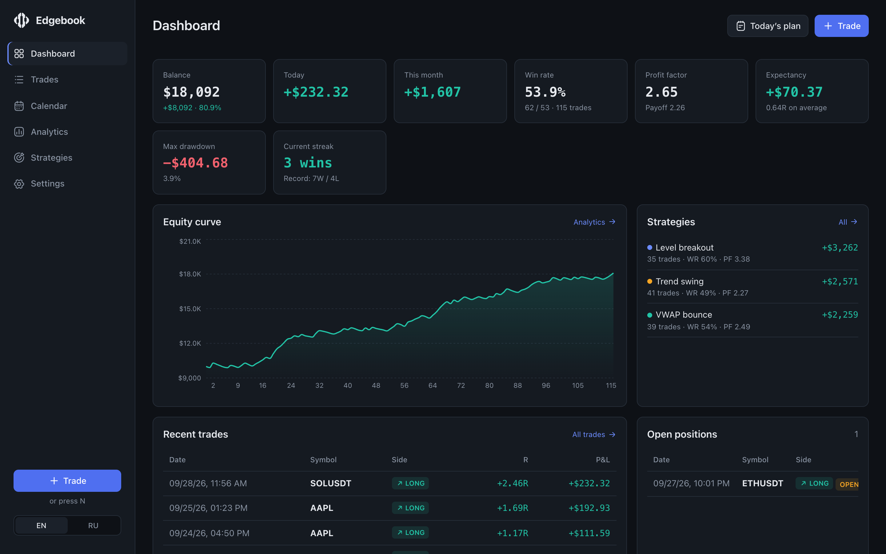
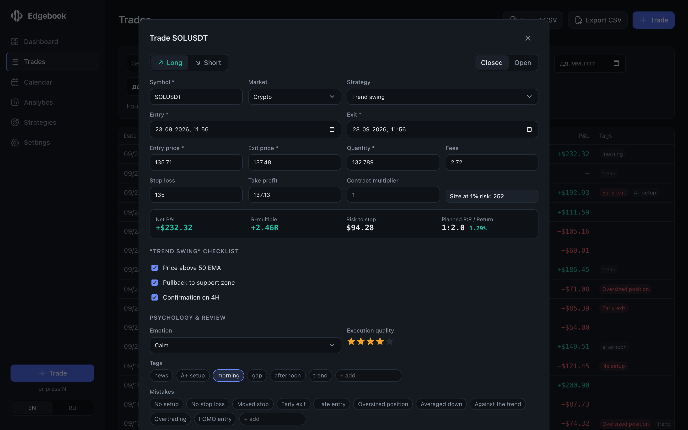
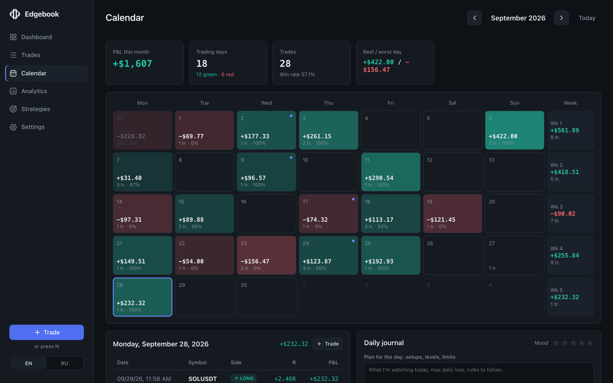
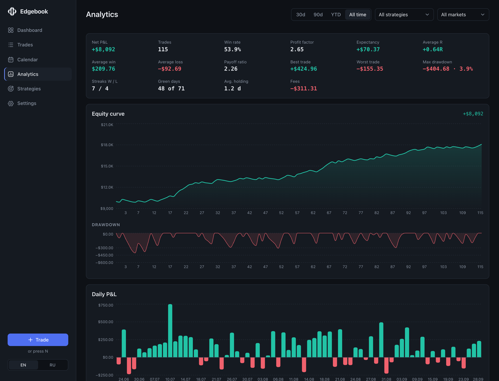
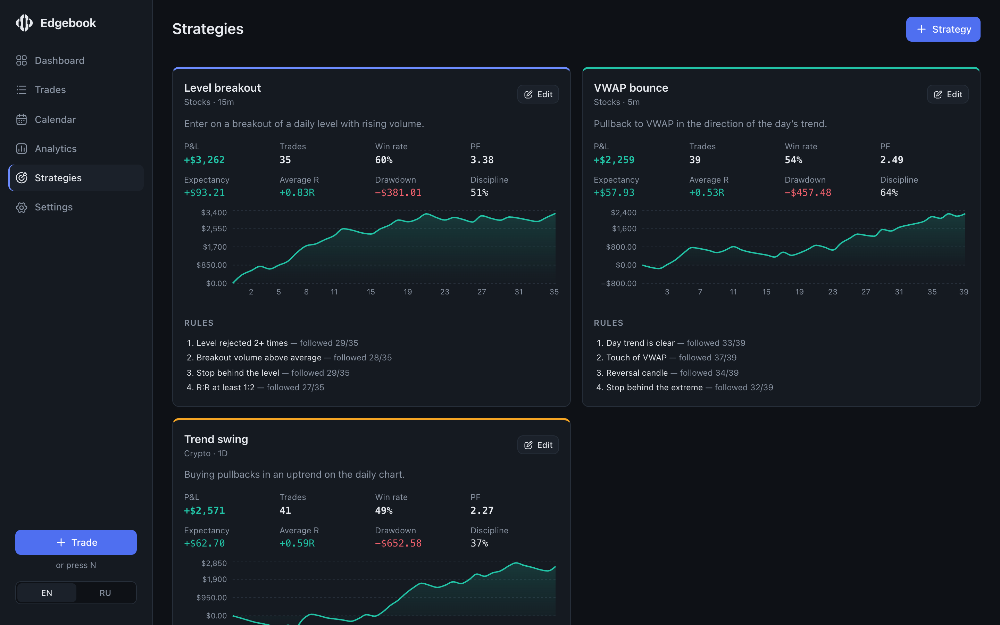

<p align="center">
  <picture>
    <source media="(prefers-color-scheme: dark)" srcset="docs/logo-dark.svg">
    
  </picture>
</p>

<h1 align="center">Edgebook</h1>

<p align="center">
  <b>A trading journal that helps you find your edge.</b><br>
  Log trades, review every day on a P&amp;L calendar, and see which setups, habits and mistakes actually drive your results.
</p>

<p align="center">
  
  
  
  
  
</p>

<p align="center">
  
</p>

## Why Edgebook

Most traders know their P&L. Few know *why* it looks the way it does. Edgebook turns your trade history into answers:

- Which strategy actually makes money — and which one only feels like it does?
- How much did moving your stop or chasing FOMO entries cost you this quarter?
- Do you perform better when you follow your checklist? (Spoiler: yes, and now you can prove it.)

No accounts, no servers, no subscriptions. Your journal lives in your browser.

## Features

### Trade log
Long and short, open and closed positions, stops and targets, fees and contract multipliers. P&L, R-multiple, planned R:R and return are calculated as you type. A built-in position size calculator suggests quantity from your risk per trade. Tag trades, mark mistakes, record emotions and execution quality, attach chart screenshots (paste straight from the clipboard). Press <kbd>N</kbd> anywhere to log a trade.

<p align="center"></p>

### P&L calendar
Every day colored by result, weekly totals, best and worst days, and a year-at-a-glance view. Each day has its own journal: a pre-market plan, an end-of-day review and your mood.

<p align="center"></p>

### Analytics
Win rate, profit factor, expectancy, payoff ratio, average R, max drawdown and streaks. Equity and drawdown curves, P&L by day, weekday and entry hour, R-multiple distribution, long vs short, holding time — plus breakdowns by strategy, symbol, tag, emotion and execution rating. Filter by period, strategy and market.

Two views you won't find in a spreadsheet:

- **Cost of mistakes** — what each tagged mistake cost you, and what your result would be without those trades.
- **Discipline** — trades where you followed every rule of your strategy vs. trades where you didn't.

<p align="center"></p>

### Strategies
Describe your setups with a market, a timeframe and entry rules. Rules become a checklist on every trade, and each strategy gets its own stats, equity curve and rule-adherence score.

<p align="center"></p>

### And also
- **English and Russian** interface, switchable at any time
- **CSV import and export**, with a template and flexible column parsing
- **JSON backup and restore** of the whole journal
- **Demo data** to explore the app before logging your own trades

## Privacy

Edgebook is local-first. Everything — trades, notes, screenshots — is stored in your browser's IndexedDB and never leaves your device. There is no backend and no analytics.

The flip side: clearing site data deletes your journal, and data doesn't sync between browsers. Use **Settings → Download backup** regularly.

## Getting started

Requires Node.js 20.19+ or 22.12+.

```bash
git clone https://github.com/4FR4KO-POVELECKO/edgebook.git
cd edgebook
npm install
npm run dev
```

Open http://localhost:5173 and click **Load demo data** to look around.

To build a static version for any web host:

```bash
npm run build   # output in dist/
```

## Importing trades from CSV

The first row is a header. Required columns: `symbol`, `entryDate`, `entryPrice`, `quantity`. Comma or semicolon delimiters both work.

```csv
symbol,market,direction,status,entryDate,exitDate,entryPrice,exitPrice,quantity,multiplier,fees,stopLoss,takeProfit,strategy,tags,mistakes,emotion,rating,notes
AAPL,stocks,long,closed,2026-09-01 10:15,2026-09-01 11:40,190.5,193.2,100,1,2,189,195,Level breakout,morning|A+ setup,,calm,4,Clean entry
```

- `direction`: `long` / `short`
- `market`: `stocks`, `crypto`, `futures`, `forex`, `options`, `other`
- `tags` and `mistakes`: separated with `|`
- Unknown strategies are created automatically

A trade's P&L is attributed to its exit day.

## Tech stack

[React](https://react.dev) · [TypeScript](https://www.typescriptlang.org) · [Vite](https://vite.dev) · [Zustand](https://zustand.docs.pmnd.rs) with IndexedDB persistence via [idb-keyval](https://github.com/jakearchibald/idb-keyval) · [Recharts](https://recharts.org) · [Hugeicons](https://hugeicons.com)

```
src/
  components/   shared UI: trade form and table, charts, icons, logo
  pages/        dashboard, trades, calendar, analytics, strategies, settings
  lib/          P&L and stats calculations, formatting, CSV, demo data
  i18n/         English and Russian dictionaries
  store.ts      persisted state and data migrations
scripts/
  logo.py       generates the logo geometry
```
